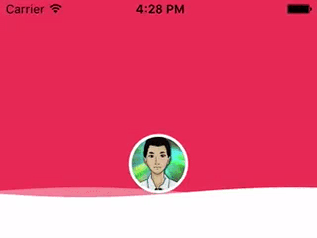

# YXWaveView [English](README.md)

[](https://github.com/Carthage/Carthage)
[](http://cocoapods.org/pods/YXWaveView)
[](http://cocoapods.org/pods/YXWaveView)
[](http://cocoapods.org/pods/YXWaveView)

波浪View，类似百度外卖的头像波浪效果。

## 截图 



## 安装

#### CocoaPod

在 `Podfile` 中添加：

```
platform :ios, '8.0'

pod 'YXWaveView'
```

运行 `pod install` 安装

#### Carthage

```
github "yourtion/YXWaveView"
```

## 使用方法

```swift
// 初始化
let frame = CGRect(x: 0, y: 50, width: self.view.bounds.size.width, height: 150)
let waterView = YXWaveView(frame: frame, color: UIColor.whiteColor())
waterView.addOverView(avatarView);

// 添加浮动层
waterView.addOverView(overView);

// 开始动画
waterView.start()

// 停止动画
waterView.stop()
```


### 参数设置

```swift
// 实浪颜色
waterView.realWaveColor = UIColor.blueColor()

// 遮罩浪颜色
waterView.maskWaveColor = UIColor.blackColor()

// 波浪速度 (默认: 0.6)
waterView.waveSpeed = 0.5

// 浪高 (默认: 5)
waterView.waveHeight = 6

// 波浪弯曲程度 (默认: 1.5)
waterView.waveCurvature = 1.2
```

查看 [Demo](YXWaveViewDemo/ViewController.swift) 了解详细使用方法。
